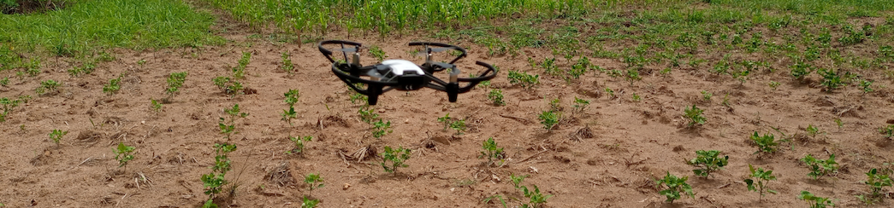
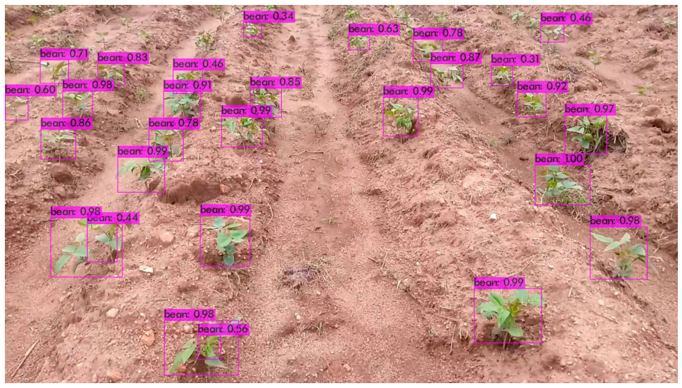
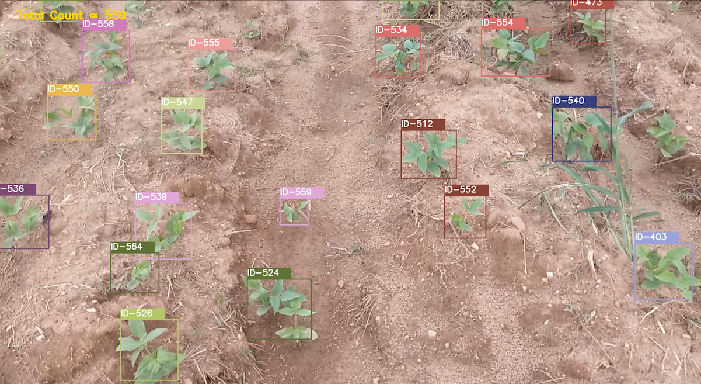

# :four_leaf_clover: :herb: :seedling: Drone Based Plant Monitoring System.

# :memo: Description.

This project demonstrates a proof of concept towards solving the challenge of proper plant monitoring and adequate data collection on large farms. By using a drone programmed to fly along a specified path, the drone transmits the video stream to a laptop for processing via wifi and the following steps are carried out;

1. **Object detection** is performed on each frame of the video stream to locate the crops by drawing bounding boxes.
   
2. Next is **Object Tracking** which associates a unique id to each crop and also keeps track of the number of crops on its path i.e crop counting.

   

3. and lastly the system takes a snapshot of the detected crops for **data collection** and further examination by farmer

## ⏳ Hardware.

- Flight Performance.
  - Max Flight Distance: 100m
  - Max Speed: 8m/s
  - Max Flight Height: 30m (without wifi repeater)
- Camera.
  - Photo: 5MP (2592x1936).
  - Format: JPG(Photo); MP4(Video)
  - FOV: 82.6°

## ⏳ Dataset.

To get enough images for this task, we converted frames from a 5 minutes video taken by the drone to get about 150 images, which was then used for training and validation.
Data Annotations was done using [LabelImg](https://github.com/tzutalin/labelImg).

## 🏽‍Custom Object Detection using [Yolov4](https://github.com/pjreddie/darknet).

The **object detection** algorithm used was the YoloV4 which offers great training speed and impressive performance.

## 🏽‍Multiple Object Tracking Using [DeepSort](https://github.com/nwojke/deep_sort).

To prevent taking multiple snapshots of the same crops, a unique id has to be assigned to each detected crop. DeepSort is the state of the art for object tracking.

## 🎯 Demo.

### [Project demo](https://bit.ly/Drones4Agric)

### [Data Science Nigeria 2021 AI Bootcamp Presentation.](https://drive.google.com/file/d/1x_QFG-_qpbM4aCPcIAdWFcYr-lNvqhTl/view?usp=sharing)

### [Project Poster](https://drive.google.com/file/d/1Zb3YCvJXl1IfLaVn2SoqAkwsr5w6lHr7/view?usp=sharing)

## Acknowledgement.

[Obafemi Awolowo University Teaching and Research Farm](https://oaufarms.com/).

## Reference

[The AI Guy's Object tracking implementation using Tensorflow](https://github.com/theAIGuysCode/yolov4-deepsort)
