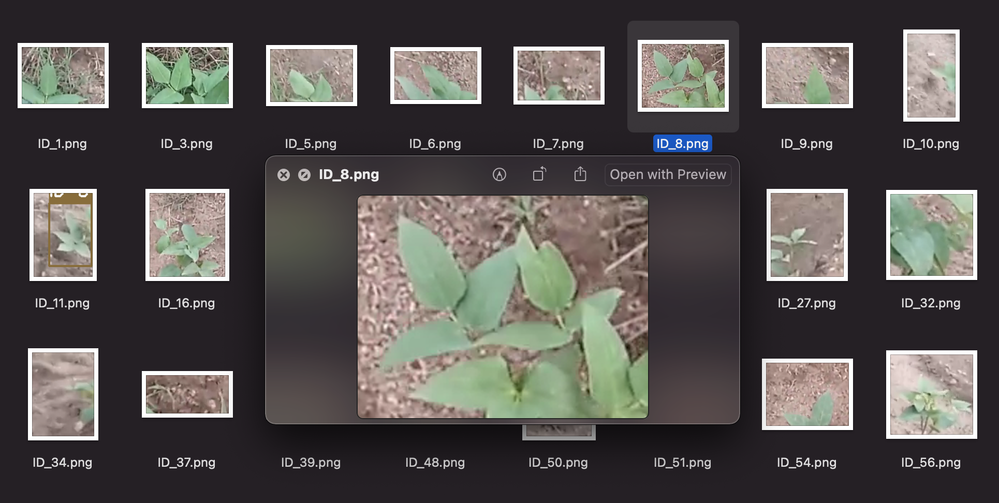

# :four_leaf_clover: :herb: :seedling: Drone Based Plant Monitoring System.

# :memo: Description.

This project demonstrates a proof of concept towards solving the challenge of proper plant monitoring and adequate data collection on large farms. By using a drone programmed to fly along a specified path, the drone transmits the video stream to a laptop for processing via wifi and the following steps are carried out;

1. Object detection is performed on each frame of the video stream to locate the crops by drawing bounding boxes.
   
2. Next is Object Tracking which associates a unique id to each crop and also keeps track of the number of crops on its path i.e crop counting
   
3. and lastly take a snapshot of the detected crops for data collection and further examination by farmer
   
